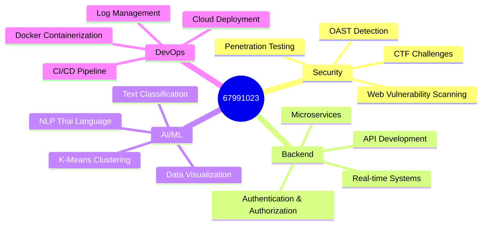

<div align="center">

# 🛡️ 67991023


### 🔐 **Cybersecurity Researcher | Full-Stack Engineer | AI/ML Developer**

```python
class Developer:
    def __init__(self):
        self.name = "67991023"
        self.role = "Security Researcher & Full-Stack Engineer"
        self.location = "🇹🇭 Thailand"
        self.interests = [
            "Web Security & Penetration Testing",
            "Backend Architecture & DevOps",
            "Machine Learning & NLP",
            "Log Management & Observability"
        ]
        self.mindset = "Security by design, Scalability by default"
        self.status = "🔥 Building secure, scalable systems"
    
    def get_tech_stack(self):
        return {
            "security": ["Golang", "Nuclei", "Burp Suite", "OAST"],
            "backend": ["Python", "FastAPI", "Node.js", "WebSocket"],
            "ai_ml": ["scikit-learn", "K-Means", "NLP", "Thai Text Processing"],
            "devops": ["Docker", "OpenSearch", "Vector", "Nginx"],
            "frontend": ["React", "Vite", "Chart.js", "TailwindCSS"]
        }
```

<p align="center">
  
</p>

[](https://github.com/67991023)
[](https://github.com/67991023)

</div>

---

## 🎯 **About Me**

ผมเป็น **Security Researcher** และ **Full-Stack Developer** ที่หลงใหลในการ **สร้างเครื่องมือ Security Tools**, **ออกแบบระบบ Backend ขนาดใหญ่**, และ **พัฒนา AI/ML Applications** สำหรับการวิเคราะห์ข้อมูล

💡 **Philosophy:**  
> "การรักษาความปลอดภัยที่ดีที่สุด คือการเข้าใจมุมมองของ Attacker และสร้างระบบที่ทน Robust ตั้งแต่ต้น"

🔍 **What I Do:**
- 🛡️ พัฒนา **Web Vulnerability Scanners** และเครื่องมือ **Penetration Testing**
- ⚙️ สร้าง **Full-Stack Log Management Systems** แบบ Enterprise-grade
- 🤖 ออกแบบ **AI/ML Systems** สำหรับ Thai Language Processing และ Text Classification
- 🏗️ พัฒนา **Microservices Architecture** ด้วย Docker และ API Gateway
- 📊 สร้าง **Real-time Dashboards** สำหรับ Monitoring และ Visualization

---

## 🚀 **Featured Projects**

### 🔥 [BurpSuitePro_Fake](https://github.com/67991023/BurpSuitePro_Fake) - **Web Vulnerability Scanner**
> **Educational Security Tool** เขียนด้วย **Golang** เพื่อเรียนรู้การทำงานของ Burp Suite Pro

**🎯 Key Features:**
- **Intercept Proxy** - ดักจับและแก้ไข HTTP/HTTPS Traffic
- **Auto Discovery** - Crawler + Fuzzer สำหรับค้นหา Hidden Endpoints
- **Vulnerability Scanner** - SQL Injection & XSS Detection
- **Repeater** - Manual Request Modification Tool
- **Real-time Dashboard** - WebSocket-based Live Monitoring
- **OAST Integration** - Out-of-Band Interaction Detection
- **Nuclei Bridge** - Integration with Nuclei Templates

**💻 Tech Stack:**  
`Golang` `TLS/Certificate Handling` `HTTP Proxy` `Goroutines` `WebSocket` `Nuclei` `OAST`

```go
// Example: Proxy Architecture
func main() {
    targetDomain = "example.com"
    oastService, _ := StartOAST()
    caCert, _ := tls.LoadX509KeyPair("ca.crt", "ca.key")
    
    go startDashboardServer()  // WebSocket Dashboard
    go StartCrawler(target)    // Auto Discovery
    go RunNucleiScan(host)     // Vulnerability Scanning
    
    proxyServer := &http.Server{
        Addr: ":8080",
        Handler: http.HandlerFunc(handleProxy),
    }
}
```

**🔗 Links:**
- 📖 [Full Documentation](https://github.com/67991023/BurpSuitePro_Fake)
- 📊 เปรียบเทียบ PortSwigger vs OpenBurp Pro (Excel file included)

---

### 📊 [CompleteLogManagement](https://github.com/67991023/CompleteLogManagement) - **Enterprise Log Management System**
> **Full-Stack Log Management Platform** สำหรับ Ingestion, Storage, Search, Visualization, และ Alerting

**🎯 Key Features:**
- **Multi-Source Ingestion** - Syslog (UDP/TCP), HTTP JSON, File Batch
- **Centralized Storage** - OpenSearch with Optimized Indexing
- **Real-time Search** - Fast Full-text Search with Filters
- **Interactive Dashboard** - React + Vite with Charts (Chart.js)
- **Alerting System** - Configurable Rules with Webhook Notifications
- **Authentication & Authorization** - JWT-based with RBAC (Admin/Viewer)
- **Multi-Tenant Support** - Data Isolation per Tenant
- **Data Retention** - Automatic Cleanup after 7 Days
- **Two Deployment Modes** - Appliance (Docker Compose) + SaaS (Cloud HTTPS)

**💻 Tech Stack:**  
`Python/FastAPI` `React` `Vite` `OpenSearch` `Vector` `Docker Compose` `JWT` `APScheduler` `TailwindCSS` `Nginx`

```python
# Backend: FastAPI with JWT Authentication
from fastapi import FastAPI, Depends, HTTPException
from jose import JWTError, jwt

app = FastAPI()

@app.post("/api/login")
async def login(credentials: LoginRequest):
    user = authenticate_user(credentials.username, credentials.password)
    if not user:
        raise HTTPException(status_code=401, detail="Invalid credentials")
    token = create_jwt_token(user)
    return {"token": token, "role": user.role, "tenant": user.tenant}

@app.get("/api/search")
async def search_logs(q: str, current_user: User = Depends(get_current_user)):
    results = opensearch_client.search(
        index=f"logs-{current_user.tenant}-*",
        body={"query": {"query_string": {"query": q}}}
    )
    return results
```

**Architecture:**
```
Log Sources → Vector (Collector) → OpenSearch (Storage) 
    → FastAPI (Backend) → React (Dashboard)
```

**🔗 Links:**
- 📖 [Full Documentation](https://github.com/67991023/CompleteLogManagement)
- 🎬 [Architecture Diagram](https://github.com/67991023/CompleteLogManagement#architecture)

---

### 🤖 [recorderAI](https://github.com/67991023/recorderAI) - **Thai Voice Recorder with ML Analytics**
> **AI-powered Voice Recognition System** สำหรับ Thai Language พร้อม Machine Learning Classification

**🎯 Key Features:**
- **Thai Speech Recognition** - Google Speech-to-Text API
- **ML Text Classification** - K-Means Clustering with TF-IDF
- **Thai Text Processing** - Custom Word Count & Validation
- **Data Visualization** - Matplotlib Charts & Comprehensive Dashboard
- **Analysis Reports** - Automated PDF/Text Report Generation
- **RESTful API** - FastAPI for Web Integration
- **Docker Support** - Containerized Deployment
- **Frontend Dashboard** - React-based UI for Recording Management

**💻 Tech Stack:**  
`Python` `scikit-learn` `K-Means` `TF-IDF` `SpeechRecognition` `pythainlp` `Matplotlib` `FastAPI` `Docker` `PostgreSQL`

```python
# ML Classification Pipeline
def ml_text_classification(voice_records):
    texts = [record['text'] for record in voice_records]
    
    # TF-IDF Vectorization
    vectorizer = TfidfVectorizer(max_features=50)
    X = vectorizer.fit_transform(texts)
    
    # K-Means Clustering
    n_clusters = min(3, len(texts))
    kmeans = KMeans(n_clusters=n_clusters, random_state=42)
    clusters = kmeans.fit_predict(X)
    
    # Create DataFrame with Results
    results_df = pd.DataFrame({
        'text': texts,
        'cluster': clusters,
        'word_count': [fix_thai_word_count(t) for t in texts]
    })
    
    return results_df, vectorizer, kmeans
```

**🔗 Links:**
- 📖 [Architecture Documentation](https://github.com/67991023/recorderAI/blob/master/ARCHITECTURE.md)
- 🎬 [Deployment Guide](https://github.com/67991023/recorderAI/blob/master/DEPLOYMENT.md)

---

### 💊 [MoodTrack](https://github.com/67991023/MoodTrack) - **Mental Health Tracking Application**
> **Full-Stack Mood Tracking Platform** สำหรับ Monitor อารมณ์และสุขภาพจิตประจำวัน

**🎯 Key Features:**
- **Mood Logging** - บันทึกอารมณ์พร้อม Emoji Selector
- **Mood Analytics** - กราฟวิเคราะห์อารมณ์ในแต่ละวัน/สัปดาห์/เดือน
- **Journal Entry** - เขียน Journal พร้อม Rich Text Editor
- **Authentication** - JWT-based Login System
- **Data Visualization** - Chart.js for Mood Trends
- **Responsive Design** - Mobile-first Approach
- **Deployment Ready** - Vercel-optimized

**💻 Tech Stack:**  
`Node.js` `Express` `MongoDB` `EJS Templates` `Chart.js` `JWT` `Vercel`

---

### 🛡️ [aegis_backend](https://github.com/67991023/aegis_backend) - **Microservices Architecture Backend**
> **Spring Boot Microservices** with Service Discovery, API Gateway, และ AI Service Integration

**🎯 Key Features:**
- **API Gateway** - Centralized Entry Point
- **Service Discovery** - Eureka Server
- **Authentication Service** - Spring Security + JWT
- **AI Service** - ML Model Integration
- **Microservices Pattern** - Independent Services

**💻 Tech Stack:**  
`Java` `Spring Boot` `Spring Cloud` `Eureka` `Spring Security` `Microservices Architecture`

---

## 💻 **Tech Stack & Skills**

### 🔐 **Security & Penetration Testing**


**Expertise:**
- Web Vulnerability Scanning (SQL Injection, XSS, SSRF)
- Proxy & Traffic Interception
- Out-of-Band Interaction Detection
- CTF Problem Solving

### ⚙️ **Backend & API Development**


**Expertise:**
- RESTful API Design
- WebSocket Real-time Communication
- JWT Authentication & RBAC
- Microservices Architecture

### 🤖 **AI & Machine Learning**


**Expertise:**
- K-Means Clustering
- TF-IDF Vectorization
- Thai Language Processing
- Text Classification

### 🗄️ **Databases & Storage**


### 🎨 **Frontend & Visualization**


### 🛠️ **DevOps & Tools**


---

## 📊 **GitHub Stats**

<div align="center">


</div>

<div align="center">

[](https://git.io/streak-stats)

</div>

---

## 🏆 **Highlight Skills**

<div align="center">



</div>

---

## 🎯 **Current Focus**

🔭 **Working On:**
- 🛡️ Enhancing **BurpSuitePro_Fake** with Advanced Scanning Techniques
- 📊 Scaling **CompleteLogManagement** for High-Volume Logs (>10K logs/sec)
- 🤖 Improving **recorderAI** ML Models for Better Thai Text Classification

🌱 **Learning:**
- 🔐 Advanced Web Application Firewall (WAF) Bypass Techniques
- ☁️ Kubernetes & Cloud-Native Security
- 🧠 Deep Learning for Security Anomaly Detection

💬 **Ask Me About:**
- Web Security & Vulnerability Assessment
- Building Scalable Backend Systems
- Machine Learning for Text Analysis
- Full-Stack Development Best Practices

---

## 📫 **Connect With Me**

<div align="center">

[](https://github.com/67991023)
[](mailto:your.email@example.com)

</div>

---

## 📄 **License**

Most of my projects are licensed under the **MIT License** - see individual project repositories for details.

---

<div align="center">

### 💡 *"Security is not a product, but a process. Build it right from the start."*

**⚡ Let's build secure, scalable, and intelligent systems together! ⚡**


</div>
