<div align="center">

# 🌌 SIRANA SAESOO


[](https://github.com/67991023)
[](https://github.com/67991023?tab=followers)
[](https://github.com/67991023?tab=repositories)

</div>

---

<div align="center">

## 🔮 **WHO AM I**

</div>

```ascii
╔═══════════════════════════════════════════════════════════════════════════╗
║                                                                           ║
║   👾 CYBERSECURITY RESEARCHER | 🚀 FULL-STACK ARCHITECT | 🤖 AI ENGINEER  ║
║                                                                           ║
║   "I don't just code. I architect systems, break vulnerabilities,        ║
║    and teach machines to think."                                         ║
║                                                                           ║
║   🔐 Penetration Testing          🎯 System Architecture                 ║
║   🛡️ Web Security Tools            ⚡ Real-time Systems                   ║
║   🤖 Machine Learning             📊 Data Engineering                     ║
║   🐳 Docker & Microservices       🔥 DevOps & Automation                 ║
║                                                                           ║
╚═══════════════════════════════════════════════════════════════════════════╝
```

<div align="center">

### 💀 **TECH ARSENAL**


<br/>


</div>

---

<div align="center">

## 🎯 **SIGNATURE PROJECTS**

</div>

<table>
<tr>
<td width="50%">

### 🔥 [BurpSuitePro_Fake](https://github.com/67991023/BurpSuitePro_Fake)
**🛡️ Educational Web Security Scanner**

```go
// Golang Proxy + Nuclei + OAST
type Scanner struct {
    Proxy      *TLSProxy
    Crawler    *AutoDiscovery
    Nuclei     *VulnScanner
    OAST       *OOBDetector
    Dashboard  *WebSocketUI
}
```


</td>
<td width="50%">

### 📊 [CompleteLogManagement](https://github.com/67991023/CompleteLogManagement)
**🔍 Enterprise Log Platform**

```python
# FastAPI + OpenSearch + Vector
class LogPipeline:
    Ingest: Vector
    Store: OpenSearch
    API: FastAPI
    UI: React
    Auth: JWT + RBAC
```


</td>
</tr>
<tr>
<td width="50%">

### 🤖 [recorderAI](https://github.com/67991023/recorderAI)
**🎙️ Thai Voice + ML Analytics**

```python
# Speech-to-Text + K-Means
ML_Pipeline = {
    'Voice': 'Google STT',
    'NLP': 'Thai Processing',
    'ML': 'K-Means + TF-IDF',
    'Viz': 'Matplotlib'
}
```


</td>
<td width="50%">

### 💊 [MoodTrack](https://github.com/67991023/MoodTrack)
**🧠 Mental Health Platform**

```javascript
// Node.js + Express + MongoDB
const app = {
  mood_tracking: 'Daily logs',
  analytics: 'Chart.js viz',
  auth: 'JWT tokens',
  deploy: 'Vercel'
}
```


</td>
</tr>
</table>

<div align="center">

**🛡️ [aegis_backend](https://github.com/67991023/aegis_backend)** - Spring Boot Microservices Architecture  


</div>

---

<div align="center">

## ⚡ **POWER STATS**


</div>

---

<div align="center">

## 🎨 **SKILL MATRIX**

```mermaid
%%{init: {'theme':'dark', 'themeVariables': { 'fontSize':'16px'}}}%%
mindmap
  root((🌌 **Sirana Saesoo**))
    🔐 **Security Engineering**
      Web Application Security
        SQL Injection Detection
        XSS & CSRF Protection
        SSRF Exploitation
      Penetration Testing
        Burp Suite Proficiency
        Nuclei Template Writing
        OAST Techniques
      Security Tools
        Custom Scanner Development
        Proxy & Traffic Analysis
        Vulnerability Research
      CTF & Competitions
        Web Challenges
        Cryptography
        Reverse Engineering
    
    ⚙️ **Backend Architecture**
      API Development
        RESTful Design
        GraphQL
        WebSocket Real-time
        gRPC Microservices
      Authentication & Authorization
        JWT Implementation
        OAuth2 & OIDC
        RBAC Systems
        Session Management
      Database Design
        PostgreSQL Optimization
        MongoDB Schemas
        Redis Caching
        OpenSearch Indexing
      Microservices
        Service Discovery
        API Gateway
        Load Balancing
        Circuit Breakers
    
    🤖 **AI & Machine Learning**
      Natural Language Processing
        Thai Language Processing
        Text Classification
        Sentiment Analysis
        Named Entity Recognition
      Machine Learning
        K-Means Clustering
        TF-IDF Vectorization
        Decision Trees
        Random Forest
      Deep Learning
        Neural Networks
        TensorFlow & PyTorch
        Model Training & Tuning
      Data Analysis
        Data Visualization
        Statistical Analysis
        Feature Engineering
        Model Evaluation
    
    🐳 **DevOps & Infrastructure**
      Containerization
        Docker Compose
        Kubernetes Orchestration
        Container Security
        Multi-stage Builds
      CI/CD Pipeline
        GitHub Actions
        Automated Testing
        Deployment Automation
        Version Control
      Monitoring & Logging
        Prometheus Metrics
        Grafana Dashboards
        ELK Stack
        Distributed Tracing
      Cloud Platforms
        AWS Services
        Cloud Architecture
        Serverless Functions
        Infrastructure as Code
    
    🎨 **Frontend Development**
      Modern Frameworks
        React & Hooks
        Vite Build Tool
        State Management
        Component Architecture
      Real-time Features
        WebSocket Integration
        Live Updates
        Push Notifications
      Data Visualization
        Chart.js
        D3.js
        Custom Dashboards
      UI/UX Design
        Responsive Design
        TailwindCSS
        Material Design
        Accessibility
```

</div>



<div align="center">

### 🏆 **EXPERTISE BREAKDOWN**

<table>
<tr>
<td align="center" width="25%">

#### 🔐 Security
```
██████████ 100%
```
**Web Vulnerability Scanning**  
**Penetration Testing**  
**OAST Detection**  
**CTF Problem Solving**

</td>
<td align="center" width="25%">

#### ⚙️ Backend
```
██████████ 100%
```
**API Architecture**  
**Microservices Design**  
**Real-time Systems**  
**Database Optimization**

</td>
<td align="center" width="25%">

#### 🤖 AI/ML
```
████████░░ 80%
```
**Text Classification**  
**NLP Thai Processing**  
**K-Means Clustering**  
**Data Visualization**

</td>
<td align="center" width="25%">

#### 🐳 DevOps
```
████████░░ 80%
```
**Docker & K8s**  
**CI/CD Pipelines**  
**Cloud Architecture**  
**Monitoring & Logging**

</td>
</tr>
</table>

### 💻 **TECHNOLOGY PROFICIENCY**

| Category | Technologies | Proficiency |
|----------|-------------|-------------|
| **Languages** | Go, Python, JavaScript/Node.js, Java |  |
| **Security Tools** | Burp Suite, Nuclei, OAST, Custom Scanners |  |
| **Backend Frameworks** | FastAPI, Express, Spring Boot, Gin |  |
| **Databases** | PostgreSQL, MongoDB, Redis, OpenSearch |  |
| **AI/ML** | scikit-learn, TensorFlow, PyTorch, NLP |  |
| **DevOps** | Docker, Kubernetes, GitHub Actions, AWS |  |
| **Frontend** | React, Vite, TailwindCSS, Chart.js |  |

### 🎯 **SKILL HIGHLIGHTS**

<details>
<summary><b>🔐 Security & Penetration Testing</b></summary>

- ✅ Developed custom web vulnerability scanner from scratch (Golang)
- ✅ Integrated Nuclei engine for automated security testing
- ✅ Implemented OAST (Out-of-Band Application Security Testing)
- ✅ Built HTTP/HTTPS intercept proxy with TLS certificate handling
- ✅ Created real-time WebSocket dashboard for security monitoring
- ✅ Expertise in SQL Injection, XSS, CSRF, and SSRF detection
- ✅ Active CTF participant and security researcher

</details>

<details>
<summary><b>⚙️ Backend & System Architecture</b></summary>

- ✅ Designed enterprise-grade log management system (10K+ logs/sec)
- ✅ Built microservices architecture with Spring Boot & Eureka
- ✅ Implemented JWT authentication with RBAC across multiple services
- ✅ Created real-time data pipelines with Vector and OpenSearch
- ✅ Developed RESTful APIs with FastAPI and Node.js/Express
- ✅ Optimized database queries and implemented caching strategies
- ✅ Built WebSocket servers for real-time bidirectional communication

</details>

<details>
<summary><b>🤖 AI & Machine Learning</b></summary>

- ✅ Developed Thai language NLP system with speech-to-text
- ✅ Implemented K-Means clustering for text classification
- ✅ Built TF-IDF vectorization pipeline for document analysis
- ✅ Created custom Thai word segmentation algorithms
- ✅ Designed ML-powered analytics dashboards
- ✅ Experience with scikit-learn, TensorFlow, and PyTorch
- ✅ Data visualization with Matplotlib and interactive charts

</details>

<details>
<summary><b>🐳 DevOps & Cloud Infrastructure</b></summary>

- ✅ Containerized applications with Docker & Docker Compose
- ✅ Deployed multi-container systems with orchestration
- ✅ Set up CI/CD pipelines with GitHub Actions
- ✅ Implemented monitoring with Prometheus and Grafana
- ✅ Configured Nginx as reverse proxy and load balancer
- ✅ Managed cloud deployments on AWS and Vercel
- ✅ Automated deployment workflows and infrastructure management

</details>

</div>

---

<div align="center">

## 🌟 **CURRENT FOCUS**

</div>

<table>
<tr>
<td>

### 🔭 **BUILDING**
```diff
+ Advanced Vulnerability Scanner
+ Enterprise Log Analytics Platform
+ AI-Powered Security Tools
+ Cloud-Native Microservices
```

</td>
<td>

### 🌱 **LEARNING**
```yaml
learning:
  - Advanced Kubernetes Security
  - Deep Learning for Anomaly Detection
  - Cloud-Native Architecture
  - Zero-Trust Security Models
```

</td>
<td>

### 💬 **EXPERTISE**
```json
{
  "security": "★★★★★",
  "backend": "★★★★★",
  "ai_ml": "★★★★☆",
  "devops": "★★★★☆"
}
```

</td>
</tr>
</table>

---

<div align="center">

## 🎯 **ACHIEVEMENTS**


</div>

---

<div align="center">

## 🌐 **CONNECT**

[](https://github.com/67991023)
[](mailto:contact.67991023@gmail.com)

**💬 Open for collaborations, security research, and interesting projects!**

</div>

---

<div align="center">

## 📊 **PROFILE DETAILS**


<table>
<tr>
<td>

</td>
<td>

</td>
</tr>
<tr>
<td>

</td>
<td>

</td>
</tr>
</table>

</div>

---

<div align="center">

## 🐍 **CONTRIBUTION SNAKE**


</div>

---

<div align="center">

### ⚡ **"Break it. Build it. Secure it. Scale it."** ⚡


**⭐ If you find my work useful, please star my repositories!**

</div>

<div align="center">
  
**🔐 Licensed under MIT | 🌟 Thank you for visiting!**

</div>
